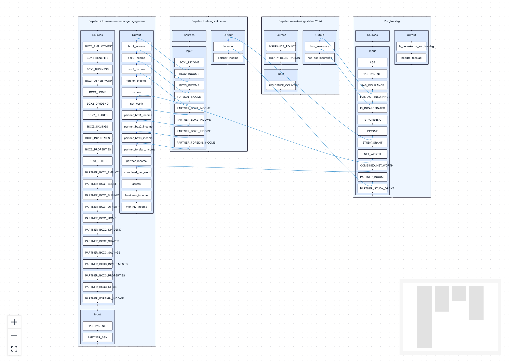

# Graph analysis



## Developing

Install the dependencies once with `pnpm install`. Then, start a development server:

```sh
pnpm dev
```


## Building

To create a production version of your app:

```sh
pnpm build
```

You can preview the production build with `pnpm preview`.
