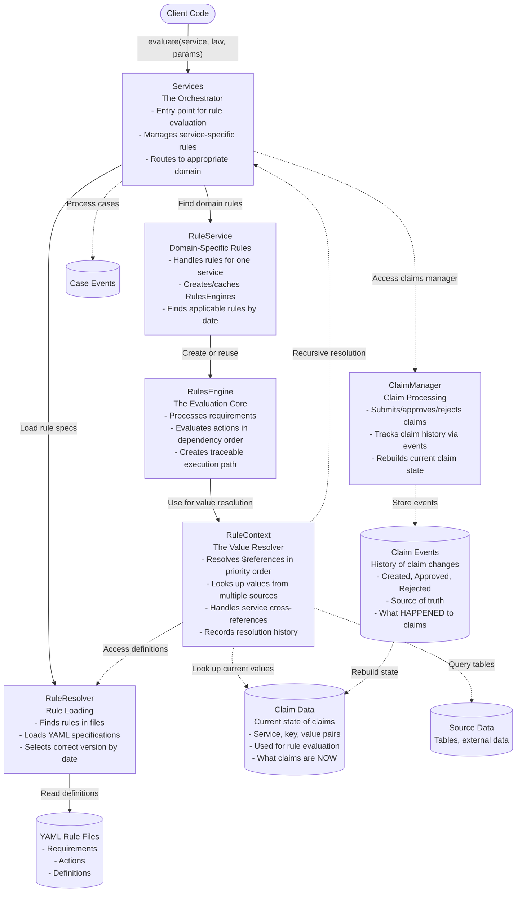

# Architecture

## Overview

This architecture represents a rules engine [law](../law) system designed for processing legal and administrative rules
in a flexible, maintainable way. The system follows a domain-driven design with event sourcing to provide transparency,
auditability, and flexibility in rule application.

The rules engine allows domain-specific rules to be defined as data (in YAML) rather than code, enabling non-technical
experts to manage rules while ensuring consistent, transparent application. The system handles complex rule
dependencies, recursive rule resolution, and integration with event-sourced domain models.

## How It Works

The system operates through several key mechanisms:

### Rule Evaluation Flow

1. Client code initiates evaluation by calling `Services.evaluate()` with a service type, law, and parameters
2. Services routes to the appropriate RuleService for the domain
3. RuleService creates or retrieves a cached RulesEngine for the specific law and date
4. RulesEngine evaluates requirements, and if met, executes actions in dependency order
5. Throughout evaluation, RuleContext resolves values from multiple sources

### Value Resolution

RuleContext resolves references (paths like `$variable_name`) by checking multiple sources in priority order:

1. Claims (citizen-provided values)
2. Local scope (within current context)
3. Rule definitions
4. Input parameters
5. Previously calculated outputs
6. External data sources
7. Other services (recursive resolution)

### Event Sourcing Integration

The system uses event sourcing for cases and claims:

- Events are immutable facts about what happened (the source of truth)
- Current state is derived by applying all events in sequence
- Rule evaluation works with the current state, not directly with events
- Case events can trigger rules automatically through event handlers
