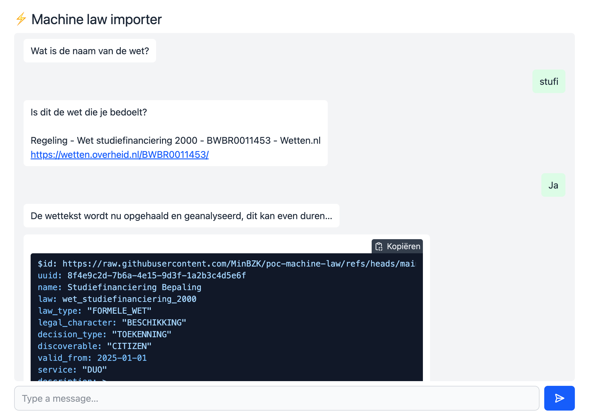

# Law importer




## Developing

Install the dependencies once with `pnpm install`. Then, start a development server:

```sh
pnpm dev
```

(However, this will be broken due to the Python backend not serving from the same domain.)


## Building

First, copy the `.env.example` file to `.env` and set its values. Then build the project using Docker, e.g.:

```sh
docker build -t poc-machine-law .
docker run --env-file .env --rm -p8000:8000 poc-machine-law
```

The importer is then available under http://localhost:8000/importer/


## Building (alternatively)

See the comment above about the `.env` file. Then:

```sh
cd importer
pnpm install
pnpm build
cd ../..
source .venv/bin/activate
uv run --env-file=.env web/main.py
```

The importer is then also available under http://localhost:8000/importer/
